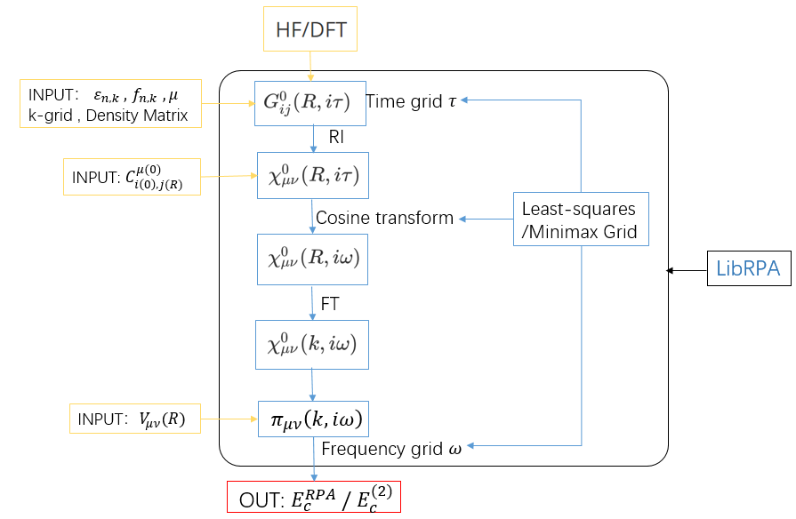
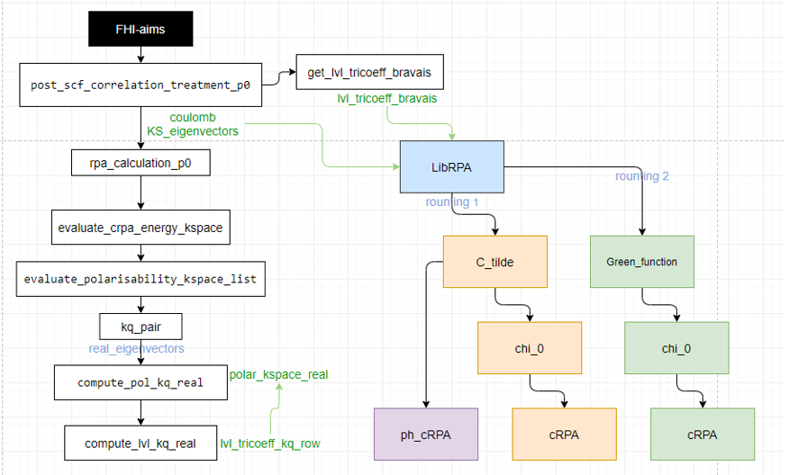
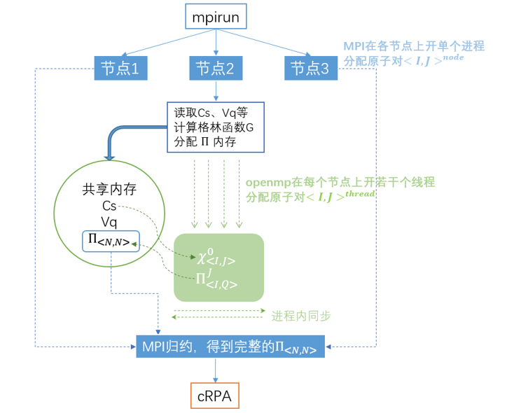

# LibRPA

LibRPA is a standalone software aiming to calculate independent response function by space-time algorithm.

## How to compile?

1. git clone or download the code package
2. modify 'make.inc' according your environment
3. make

## Interfaced with FHI-aims

At this stage, LibRPA have interfaced with FHI-aims by writing and reading files:

- stru_out
- band_out
- KS_eigenvector_#.txt
- Cs_data_#.txt
- coulomb_mat_#.txt

The modified FHI-aims code files can be checked in `FHI-aims-outifile-code/`. \
Consider the different versions of FHI-aims, you had better modify the FHI-aims files manual instead of recovering them.\
Take care the new variable declarations in the beginning and the places of writing files.
For convenience, we provide patch files in `interfaces/FHI-aims`. You may find the one appropriate \
for your aims version.

Once you successfully finished FHI-aims calculation, the out-files will be ready for LibRPA. \
Then run LibRPA in the same working directory.

## Running LibRPA

LibRPA can be parallelized to hundreds of cores by MPI+openmp.\
There are two input parameters needed to be care: 1) The minimax grids number; 2) The Green function threshold.
When you run LibRPA, the two parameters needed to be offered, like:

```shell
$ mpirun /home/rongshi/LibRPA/chi0_main.exe 16 1e-4 > LibRPA_$workdir.$SLURM_JOB_ID.out
```

Other input parameters are parsed by specifying keyword and value pair in file `librpa.in` at the same directory.
For example, if you want to set Coulomb threshold to `1e-5` and task to G0W0, you can write `librpa.in` as

```
task = g0w0
vq_threshold = 1e-5
```

If `librpa.in` and the related keyword is not found, the default value will be used.

### Code design




